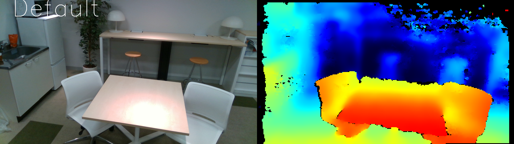
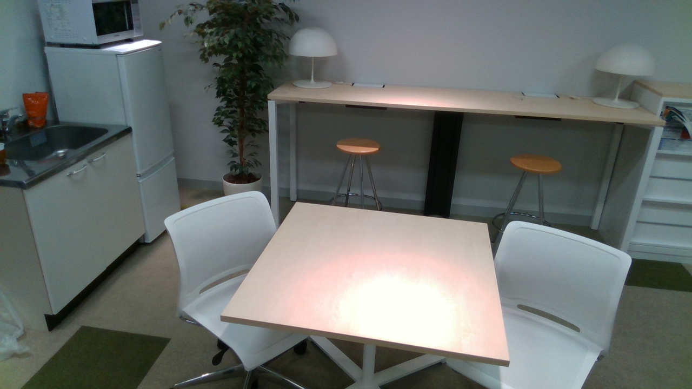

# pyrs
*another* Python wrapper for Intel Realsense camera


## Dependencies:

- OpenCV (cv2 for Python)
- librealsense2 ([pyrealsense2](https://github.com/IntelRealSense/librealsense/tree/master/wrappers/python))
- numpy

## Usage:

### Demo:

To start the pyrs demo, run:

```
python pyrs.py
```

### Code:

The recommended way is to use `with` statement and run a loop for each frames:

``` Python
import PyRS

with PyRS() as pyrs:
  while True:
    # Wait for a coherent pair of frames: depth and color
    pyrs.update_frames()

    # Get images as numpy arrays
    color_image = pyrs.get_color_image()  # RGB
    depths_image = pyrs.get_depths_frame()  # Depth
    colorized_depths = pyrs.get_colorized_depths_frame()  # Colorized Depth (for rendering)

    # do something with the frame
    ...
```

But you can also use it normally by creating an instance:

```Python
import PyRS

pyrs = PyRS()

while True:
  pyrs.update_frames()
  ...
```

### Commands:

- `p`: save rgb and depth image
- `c`: change camera presets
- `i`: save camera intrinsics
- `q`: quit loop


## Samples:

### Viewer:


### RGB:


### Depth:

(Filtered and upsampled with nearest neighbor interpolation)


## TODO:

- [ ] Make it possible to use multiple realsense device (device selection)
- [ ] Customizable filter
